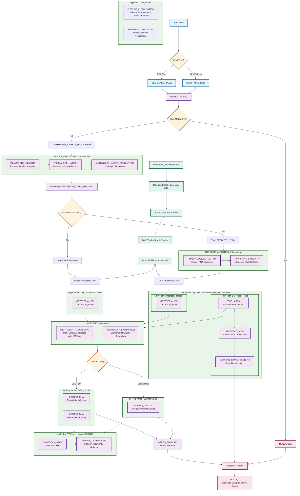

# Nextflow Pipeline Architecture

This document contains a comprehensive Mermaid flowchart diagram showing the complete architecture and data flow of the modulestesting bioinformatics pipeline.

## Pipeline Flowchart

## Architecture Overview

### Input Handling
- **BCL Files**: Demultiplexed using BCL_DEMULTIPLEX subworkflow (supports bclconvert/bcl2fastq)
- **FASTQ Files**: Direct input from samplesheet validation

### Initial Quality Control
- **Optional FASTQC**: Pre-processing quality control on raw reads before hairpin processing

### Hairpin Processing (v2 Protocol Architecture)
**NEW in v3.0**: Hairpin processing occurs FIRST, before RNA/DNA separation. This is the v2 protocol's key innovation.

- **METHYLSNP_HAIRPIN_PROCESSING**: Three-step hairpin resolution workflow
  1. **TRIMGALORE_ILLUMINA**: Remove standard Illumina sequencing adapters
  2. **TRIMGALORE_HAIRPIN**: Remove custom hairpin adapters
  3. **METHYLSNP_HAIRPIN_RESOLUTION**: Perform v2 hairpin resolution conversion (C→T conversion)
- **HAIRPIN_RESOLUTION_STATS_SUMMARY**: Generate MultiQC-compatible hairpin statistics

`★ Key Architecture Decision ─────────────────────`
**Hairpin-First Architecture**: Unlike v1.x which processed hairpins after RNA/DNA separation, v3.0 performs hairpin resolution FIRST. This leverages the v2 protocol's ability to resolve hairpins without knowing RNA vs DNA identity, enabling cleaner downstream processing.
`─────────────────────────────────────────────────`

### RNA Processing (Optional)
- **TNA_DECONVOLUTION**: RNA barcode extraction using RNABARCODEEXTRACTION module
  - Splits reads into **barcoded** (RNA) and **unbarcoded** (DNA) fractions
  - Extracts NNSR/mNNSR barcode sequences
- **RNA_STATS_SUMMARY**: Generates MultiQC-compatible statistics for barcode analysis

### Reference Management (Smart Caching)
- **PREPARE_REFERENCES**: Intelligent reference download and indexing with caching
  - **Download/Cache**: FASTA genome and GTF annotation files (from GCS or local paths)
  - **STAR Index**: Build or cache STAR genome indexes for RNA alignment (~2+ hours, cached by genome ID)
  - **Bowtie2 Index**: Build or cache Bowtie2 genome indexes for DNA alignment (~2+ hours, cached by genome ID)
  - **FASTA Indexing**: Generate .fai index files for variant calling
- **Genome-agnostic**: URL-based filename extraction supports any reference genome
- **Performance optimization**: Preserves existing index builds across pipeline runs

### Dual vs Single Processing Decision

**Dual Processing Path** (when RNA deconvolution enabled):
- **RNA Barcoded Reads** → STAR alignment → Gene quantification
- **DNA Unbarcoded Reads** → Bowtie2 alignment → Methylation analysis

**Single Processing Path** (when RNA deconvolution skipped):
- **All Reads** → Bowtie2 alignment → Methylation analysis

### RNA Analysis Pipeline (Dual Path Only)
1. **STAR_ALIGN**: Splice-aware alignment to reference genome using STAR
   - Uses GTF annotations for splice junction detection
   - Optimized for transcriptomic reads
2. **SAMTOOLS_VIEW**: Convert SAM to BAM format
3. **SUBREAD_FEATURECOUNTS**: Gene-level quantification
   - Counts reads mapping to genomic features (genes, exons)
   - Produces counts matrix for differential expression analysis

### DNA Methylation Analysis Pipeline (Both Paths)
1. **BOWTIE2_ALIGN**: Genome alignment using Bowtie2
   - For unbarcoded (DNA) reads in dual mode
   - For all reads in single mode
2. **METHYLSNP_PROCESSING**: Multi-step SAM processing
   - Mark unique reads (MarkUniread.py)
   - Mark duplicates (MarkDup.py or Picard)
   - Add XM methylation tags (AddXMtag.py)
3. **METHYLSNP_EXTRACTION**: Bismark methylation extraction
   - Extracts CpG, CHG, CHH methylation rates
   - Outputs bedGraph format for downstream analysis
   - Generates splitting reports for MultiQC

### Variant Calling (Low-Frequency Detection)
- **LOFREQ_VARIANT_CALLING**: Detect low-frequency variants in processed BAM files
  - **Multi-channel support**:
    - LOFREQ_RNA: Variant calling on barcoded (RNA) reads
    - LOFREQ_DNA: Variant calling on unbarcoded (DNA) reads
    - LOFREQ_SINGLE: Variant calling on all reads (single mode)
  - **Two-step process**:
    1. SAMTOOLS_INDEX: Index BAM files for random access
    2. LOFREQ_CALLPARALLEL: Call variants with configurable sensitivity
  - **Configurable parameters**: Coverage depth, base quality, significance thresholds
- **LOFREQ_SUMMARY**: Aggregate variant statistics across all samples for MultiQC

### Reporting and Integration
- **MultiQC**: Comprehensive HTML report combining all QC metrics:
  - FastQC raw read quality
  - TrimGalore adapter trimming statistics (Illumina + Hairpin)
  - Hairpin resolution statistics (v2 protocol metrics)
  - RNA barcode extraction rates (if enabled)
  - STAR alignment statistics (RNA reads)
  - Bowtie2 alignment statistics (DNA reads)
  - FeatureCounts gene quantification summary (RNA reads)
  - Bismark methylation analysis (CpG/CHG/CHH rates)
  - LoFreq variant calling statistics
  - Software versions from all modules
- **Pipeline Management**:
  - PIPELINE_INITIALISATION: Parameter validation and channel creation
  - PIPELINE_COMPLETION: Email/webhook notifications with MultiQC attachments

## Color Legend
- **Blue**: Input nodes (data sources)
- **Purple**: Process nodes (individual modules)
- **Orange**: Decision points (conditional logic)
- **Green**: Subworkflows (grouped processes)
- **Pink**: Output nodes (final results)
- **Teal**: Reference preparation nodes

## Major Architecture Changes from v2.0

### v3.0: Hairpin-First Architecture (Current)
- **Hairpin processing moved to beginning** of pipeline (before RNA/DNA separation)
- **STAR alignment** added for RNA reads (replaces Bowtie2 for transcriptome)
- **FeatureCounts** added for gene quantification on RNA reads
- **Dual aligner strategy**: STAR (RNA) + Bowtie2 (DNA)
- **LoFreq summary module** for aggregated variant statistics

### v2.0: STAR Migration
- Migrated from Bowtie2 to STAR for alignment (now used only for RNA in v3.0)
- Added GTF annotation support for splice-aware alignment
- Enhanced reference caching system for STAR indexes

### v1.x: Original Architecture
- Single aligner (Bowtie2 only)
- Hairpin processing after RNA/DNA separation
- No gene quantification

## File Usage
This diagram can be rendered in any Mermaid-compatible viewer including:
- GitHub markdown rendering
- Mermaid Live Editor (mermaid.live)
- VS Code with Mermaid extensions
- Documentation platforms supporting Mermaid

## Implementation Notes

### Conditional Processing
The pipeline includes several decision points that control workflow execution:
- **Skip MethylSNP**: Bypass all methylation analysis (FastQC → MultiQC only)
- **Skip RNA Deconvolution**: Process all reads as DNA (single processing path)
- **BCL vs FASTQ Input**: Automatic detection and handling of input data format

### Channel Management
Complex channel combinations ensure proper data flow:
- Methylation reports duplicated with modified IDs for barcoded/unbarcoded processing
- Reference channels converted to value channels for multiple consumption
- SAM files paired with methylation reports using channel joins
- VCF files collected across RNA/DNA channels for LoFreq summary

### Error Handling
Robust error handling throughout pipeline:
- Graceful degradation for samples with zero uniquely mapping reads
- Comprehensive diagnostics for failed libraries
- Retry mechanisms for transient failures (e.g., file system sync issues)
- Validation checks at each processing stage
