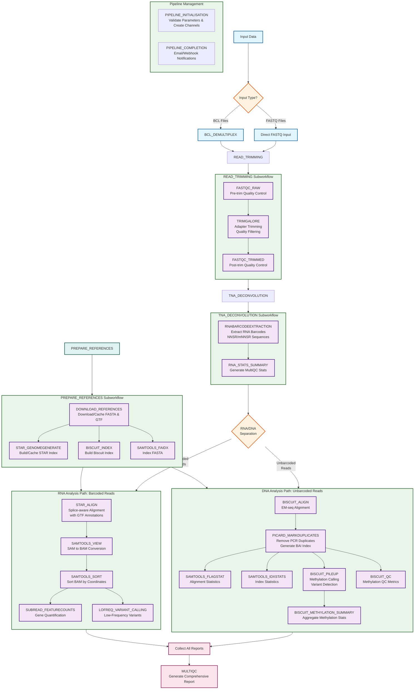

# TNA-EM-seq Pipeline Architecture

This document contains a comprehensive Mermaid flowchart diagram showing the complete architecture and data flow of the TNA-EM-seq bioinformatics pipeline.

## Pipeline Flowchart

## Architecture Overview

### Input Handling
- **BCL Files**: Demultiplexed using BCL_DEMULTIPLEX subworkflow (supports bclconvert/bcl2fastq)
- **FASTQ Files**: Direct input from samplesheet validation

### Read Trimming Pipeline
**READ_TRIMMING subworkflow** provides comprehensive quality control:
1. **FASTQC_RAW**: Pre-trimming quality assessment
2. **TRIMGALORE**: Adapter removal and quality filtering
   - Removes Illumina adapters
   - Quality trimming (NextSeq 2-color chemistry support)
   - Minimum length filtering
3. **FASTQC_TRIMMED**: Post-trimming quality verification

### RNA/DNA Separation
**TNA_DECONVOLUTION subworkflow** separates reads by RNA barcode presence:
- **RNABARCODEEXTRACTION**: Cutadapt-based extraction of NNSR/mNNSR barcodes
  - **Barcoded reads** → RNA analysis path
  - **Unbarcoded reads** → DNA analysis path
- **RNA_STATS_SUMMARY**: Generates MultiQC-compatible barcode statistics
  - Shows double-tagged, single-tagged, and unbarcoded read percentages
  - Stacked bar visualization in MultiQC report

### Reference Preparation (Smart Caching)
**PREPARE_REFERENCES subworkflow** handles all reference files:
- **DOWNLOAD_REFERENCES**: Downloads and caches FASTA genome and GTF annotation
  - Supports Google Cloud Storage (gs://) and local paths
  - Smart caching prevents redundant downloads
- **STAR_GENOMEGENERATE**: Builds or caches STAR genome index (~2+ hours, cached by genome ID)
- **BISCUIT_INDEX**: Builds Biscuit index for EM-seq alignment
- **SAMTOOLS_FAIDX**: Generates FASTA index (.fai) for variant calling

**Performance optimization**: Genome-agnostic URL-based caching preserves index builds across pipeline runs

### RNA Analysis Pipeline (Barcoded Reads)
1. **STAR_ALIGN**: Splice-aware alignment using STAR aligner
   - Uses GTF annotations for accurate splice junction detection
   - Optimized for transcriptomic reads with splice variants
2. **SAMTOOLS_VIEW**: Convert SAM to compressed BAM format
3. **SAMTOOLS_SORT**: Sort BAM by genomic coordinates
4. **SUBREAD_FEATURECOUNTS**: Gene-level quantification
   - Counts reads mapping to genes/exons
   - Produces counts matrix for differential expression
5. **LOFREQ_VARIANT_CALLING**: Detect low-frequency variants in RNA
   - BAM indexing with SAMTOOLS_INDEX
   - Variant calling with LOFREQ_CALLPARALLEL
   - Configurable coverage, quality, and significance thresholds

### DNA Methylation Analysis Pipeline (Unbarcoded Reads)
1. **BISCUIT_ALIGN**: EM-seq genome alignment using Biscuit
   - Optimized for enzymatic methylation detection
   - Preserves methylation information
2. **PICARD_MARKDUPLICATES**: Remove PCR duplicates
   - Marks duplicate reads from library preparation
   - Generates BAI index automatically
3. **SAMTOOLS_FLAGSTAT**: Comprehensive alignment statistics
4. **SAMTOOLS_IDXSTATS**: Per-chromosome alignment counts
5. **BISCUIT_PILEUP**: Methylation calling and variant detection
   - Extracts CpG, CHG, CHH methylation rates
   - Outputs VCF format for variant information
6. **BISCUIT_QC**: Methylation quality metrics
   - **Note**: EM-seq may show -nan for conversion rates (enzymatic vs. bisulfite)
   - Actual methylation data is in BISCUIT_PILEUP VCF files
7. **BISCUIT_METHYLATION_SUMMARY**: Aggregate methylation statistics for MultiQC

### Reporting and Integration
**MultiQC** generates comprehensive HTML report combining:
- **FastQC**: Pre/post-trim read quality metrics
- **TrimGalore**: Adapter trimming statistics
- **RNA Barcode Extraction**: Stacked bar plots showing double/single/unbarcoded reads
- **STAR Alignment**: RNA mapping statistics and splice junction metrics
- **FeatureCounts**: Gene quantification summary
- **Biscuit Alignment**: DNA mapping statistics
- **Picard MarkDuplicates**: PCR duplication rates
- **Biscuit Methylation**: CpG/CHG/CHH methylation percentages
- **LoFreq Variants**: Low-frequency variant statistics
- **Software Versions**: All tool versions for reproducibility

**Pipeline Management**:
- **PIPELINE_INITIALISATION**: Parameter validation and channel creation
- **PIPELINE_COMPLETION**: Email/webhook notifications with MultiQC attachments

## Color Legend
- **Blue**: Input nodes (data sources)
- **Purple**: Process nodes (individual modules)
- **Orange**: Decision points (conditional logic)
- **Green**: Subworkflows (grouped processes)
- **Pink**: Output nodes (final results)
- **Teal**: Reference preparation nodes

## Key Features

### Paired-End Processing
- Complete paired-end support throughout entire pipeline
- RNA barcode extraction handles both R1 and R2
- STAR alignment preserves read pairing
- Biscuit alignment supports paired-end EM-seq data

### Dual-Path Architecture
**RNA Barcoded Path**:
- STAR aligner for splice-aware alignment
- Gene quantification with FeatureCounts
- Low-frequency variant calling with LoFreq

**DNA Unbarcoded Path**:
- Biscuit aligner for EM-seq methylation
- Duplicate marking with Picard
- Methylation calling and QC with Biscuit suite

### Smart Caching System
- **Reference files**: Cached in `references/fasta/` by filename
- **STAR indexes**: Cached in `references/star_indexes/genome_name/`
- **Biscuit indexes**: Cached in `references/biscuit_indexes/genome_name/`
- **Override options**: `--force_redownload_references`, `--force_rebuild_indexes`

### MultiQC Integration
All modules output MultiQC-compatible reports:
- Cutadapt reports for RNA barcode extraction
- Custom content for RNA barcode statistics (stacked bars)
- STAR alignment logs
- FeatureCounts summary statistics
- Biscuit QC reports
- LoFreq variant summary (custom JSON format)

## File Usage
This diagram can be rendered in any Mermaid-compatible viewer including:
- GitHub markdown rendering
- Mermaid Live Editor (mermaid.live)
- VS Code with Mermaid extensions
- Documentation platforms supporting Mermaid

## Implementation Notes

### Conditional Processing
The pipeline includes decision points controlling workflow execution:
- **BCL vs FASTQ Input**: Automatic detection and handling of input format
- **RNA Deconvolution**: Separates reads into RNA and DNA processing paths

### Channel Management
Complex channel combinations ensure proper data flow:
- RNA barcode extraction creates two branches (barcoded/unbarcoded) from single input
- Reference channels converted to value channels for multiple consumption
- BAM files paired with BAI indexes using channel joins
- MultiQC collects reports from all modules using collect() operations

### Sample Name Cleaning
**Universal sample name cleaning** for MultiQC visualization:
- Regex patterns remove TrimGalore suffixes (`_val_1`, `_val_2`)
- Handles concatenated paired-end names from RNA extraction
- Prevents duplicate sample entries in MultiQC General Statistics
- Works across diverse sample naming conventions

### Error Handling
Robust error handling throughout pipeline:
- Graceful degradation for samples with low/no mapping reads
- Comprehensive diagnostics for failed libraries
- Validation checks at each processing stage
- EM-seq specific handling (-nan conversion rates expected)

## Version History

### Current Version (v1.0.0)
- **TNA-EM-seq pipeline** with paired-end support
- **Dual-path architecture**: STAR (RNA) + Biscuit (DNA)
- **RNA barcode extraction** with NNSR/mNNSR support
- **EM-seq methylation** analysis with Biscuit suite
- **Low-frequency variant calling** with LoFreq
- **Smart reference caching** for STAR and Biscuit indexes
- **Comprehensive MultiQC** integration with custom visualizations
